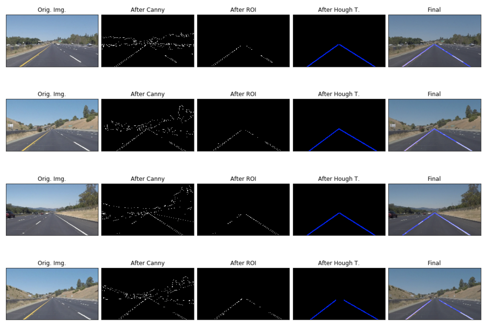

# **Finding Lane Lines on the Road** 

Overview
---

When we drive, we use our eyes to decide where to go.  The lines on the road that show us where the lanes are act as our constant reference for where to steer the vehicle.  Naturally, one of the first things we would like to do in developing a self-driving car is to automatically detect lane lines using an algorithm.

In this project you will detect lane lines in images using Python and OpenCV.  OpenCV means "Open-Source Computer Vision", which is a package that has many useful tools for analyzing images.  

### To Run the project
Step 1. Follow [this instruction](https://classroom.udacity.com/nanodegrees/nd013/parts/fbf77062-5703-404e-b60c-95b78b2f3f9e/modules/83ec35ee-1e02-48a5-bdb7-d244bd47c2dc/lessons/8c82408b-a217-4d09-b81d-1bda4c6380ef/concepts/4f1870e0-3849-43e4-b670-12e6f2d4b7a7) to install necessary software 

Step 2. Clone this project
- git clone https://github.com/tjctjc/CarND-LaneLines-P1

Step 3. Run Jupyter Notebook

Step 4. Click on P1.ipynb to launch the project code

### Reflection
### 1. Describe your pipeline. As part of the description, explain how you modified the draw_lines() function.
- Convert RGB image to Gray scale image
- Blur the image to remove some of the noise before further processing the image
- Apply Canny Edge filter on the image to get edges
- Because the way the camera is mounted in the car, we can assume the region of our interests. 
Thus, we can only use the region of interests for further processing
- I use Hough Transform algorithm to find line segments in the region.
- Based on two points, I get slopes. Based on slope value, I know whether it's left or right lane.
  I split the lane lines into left and right by their slopes, respectively. I added a moving average over the slopes in order to include only the points that fell within certain level. Also, if two lines overlapping, I recalculate the slope and points to draw short lines.

### 2. Identify potential shortcomings with your current pipeline
- If there's obsticles just in front of camera, the pipeline might detect those as lanes or not be able to find lanes at all
- In conditions such as night time, snowy and etc, the pipeline might not be able to detect lanes

### 3. Suggest possible improvements to your pipeline
- Based on some parameters which could be changing based on scene conditions(such as darkness/brightness/whether/etc), using those parameters we could develop an algorithm to change parameters for Hough Transform/Canny/etc algorithm so that it can dynamically be changing based on road/scene condition.

